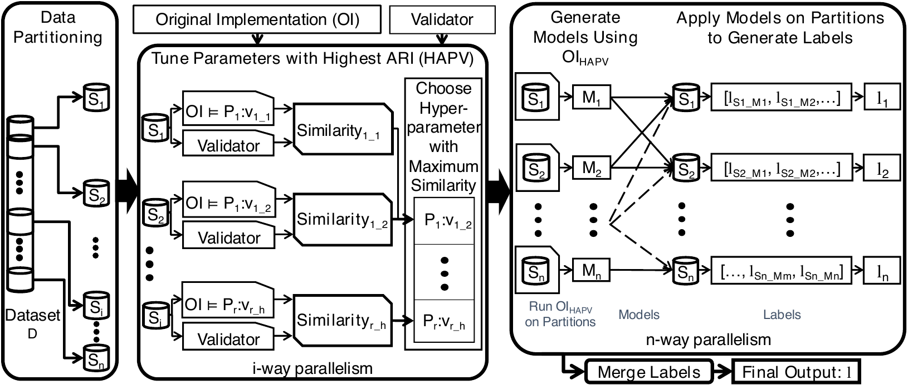

# ACE - <u>𝗔</u>lgorithm-independent <u>𝗖</u>lustering Acc<u>𝗘</u>leration and Parallelization

This repository contains the implementation of the **ACE** framework. It supports running standard clustering algorithms in two parallelized execution modes:
* **Local Parallel Mode**: Distributes the workload across concurrent threads on a single local machine.
* **AWS Distributed Mode**: Distributes the workload across independent AWS EC2 worker instances (nodes), coordinated via S3.

This repository contains the official implementation of the paper:
[**ACE: Algorithm-Independent Acceleration and Parallelization of Clustering Implementations**](https://link.springer.com/chapter/10.1007/978-3-031-85697-6_11) (PPAM24).

[](https://doi.org/10.1007/978-3-031-85697-6_11)

## Architecture



ACE operates in a black-box, algorithm-independent manner, requiring only the black-box clustering implementation and its parameter ranges. The framework consists of four main stages:
1. **Data Partitioning**: Shuffles and divides the dataset $D$ into $n$ smaller partitions ($S_1, S_2, \dots, S_n$) to reduce memory usage and enable parallelization.
2. **Parallel Parameter Tuning (HAPV)**: Conducts a parallel search to determine the hyperparameter values with the highest accuracy (HAPV) using a validation clustering algorithm.
3. **Label Generation**: Concurrently runs the clustering algorithm on all partitions using the tuned HAPV parameters.
4. **Label Merging**: Integrates the local partition clustering labels ($l_1, l_2, \dots, l_n$) into a unified global clustering output ($l$).

## Environments & Prerequisites
* **Python**: 3.9+
* **Packages**: `pandas`, `numpy`, `scipy`, `scikit-learn`, `boto3`

---

## Configuration & Credentials (For AWS Mode)

The system uses an **IAM Instance Profile (Role)** attached to the EC2 instances.

1. **Local AWS Profile**:
   Ensure you have configured your AWS CLI credentials on your local machine:
   ```bash
   aws configure
   ```

2. **Create the IAM Role and Instance Profile**:
   You can easily set up the required IAM role, policy, and instance profile restricted strictly to the project's S3 bucket by running the helper script:
   ```bash
   bash Setup/setup_iam.sh
   ```
   This will create a custom policy called `ACE-S3-Bucket-Policy` and an EC2 role/instance profile called `ACE-EC2-S3-Role`.

3. **Project Configuration File**:
   Copy `config.template.json` to `config.json` (this file is ignored by Git to protect your configuration settings):
   ```bash
   cp config.template.json config.json
   ```
   Edit `config.json` and enter your values:
   * `AMI_ID`: Your custom pre-baked EC2 AMI (with python libraries pre-installed).
   * `REGION`: The AWS region of your resources (e.g. `us-east-2`).
   * `BUCKET_NAME`: The S3 bucket name where datasets and results will be transferred.
   * `INSTANCE_TYPE`: The EC2 instance type for workers (default: `t3.micro`).
   * `IAM_INSTANCE_PROFILE`: The name of the IAM Instance Profile you created (e.g. `ACE-EC2-S3-Role`).

---

## Usage

Run the unified `run.py` script at the root of the repository with your chosen mode and parameters.

### 1. Local Parallel Mode
Runs the clustering algorithm locally on your machine, parallelizing the workload across multiple threads.
```bash
python run.py local Dataset/letter.csv HAC
```

### 2. AWS Distributed Mode
Splits the dataset, launches EC2 worker instances in parallel to perform clustering, pulls results, performs the hierarchical merge locally, and automatically terminates all instances and flushes the S3 bucket.
```bash
python run.py aws Dataset/letter.csv HAC
```

### Command Line Arguments
* `mode`: `local` or `aws`
* `file_path`: Path to your local CSV dataset file (e.g., `Dataset/letter.csv`).
* `algo`: The clustering algorithm name (`HAC`, `DBSCAN`, `GMM`, `SC`, `AP`).
* `--n-clusters`: Number of clusters to find (default: `3`).
* `--bucket`: Override S3 bucket name.
* `--workers`: Number of EC2 instances to launch in parallel (default: `4`).

---

## Citation

```bibtex
@inproceedings{10.1007/978-3-031-85697-6_11,
author = {Ahmed, Muyeed and Neamtiu, Iulian},
title = {ACE: Algorithm-Independent Acceleration and&nbsp;Parallelization of&nbsp;Clustering Implementations},
year = {2024},
isbn = {978-3-031-85696-9},
publisher = {Springer-Verlag},
address = {Berlin, Heidelberg},
url = {https://doi.org/10.1007/978-3-031-85697-6_11},
doi = {10.1007/978-3-031-85697-6_11},
booktitle = {Parallel Processing and Applied Mathematics: 15th International Conference, PPAM 2024},
pages = {161–176},
location = {Ostrava, Czech Republic}
}
```
